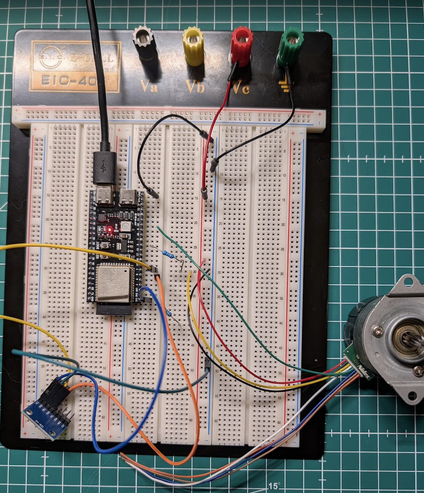
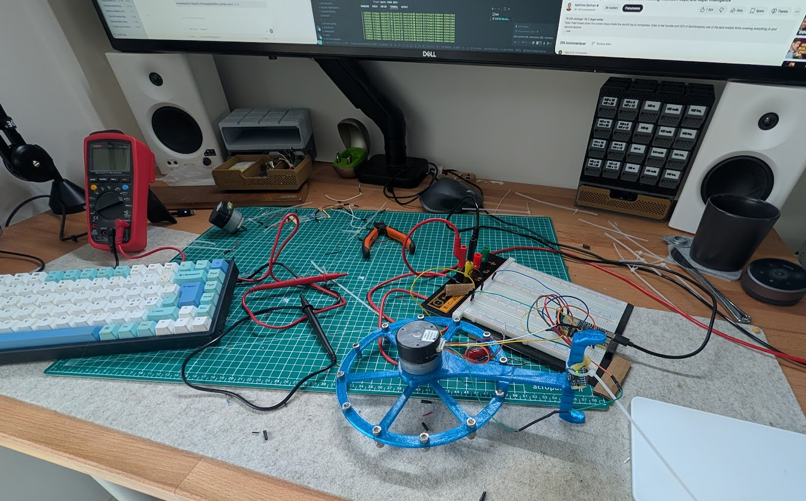

# the-cube

Monorepo for the full self-balancing reaction wheel project. The goal is to build a cube that can balance on two axes using a PID / PD-based controller, and later eventually replace the PID / PD with a CNN.
This is an attempt to Combine embedded, AI and control system. 

## Phase 1
Getting reliable read and writes of the GY-521 sensor and the Nidec motor. 

### Sensor readings
GY-521 readings and prints:
- raw acceleration
- gyroscope data
- tilt angle

### Test the motor separately
Verify that the motor can:
- spin forward
- spin backward
- stop

### Connect sensor data to motor
Once the sensor and motor work independently:
- tilt forward -> motor spins in one direction
- tilt backward -> motor spins in the other direction

## Phase 2
Use the tilt data to make the cube start correcting itself.

### Add basic control
Map the tilt angle to motor output:
- small tilt -> small correction
- large tilt -> larger correction

### Tune PID / PD
Adjust the controller so the cube can:
- react quickly
- avoid overshooting
- recover after being pushed

### Next phase: Reaching balance
The goal is not perfect balance yet, but the first prototype cant event stand. Lots of oscillations and instability.

## Phase 3
Reaching balance in one axis with a single motor.  

### Reaching balance
PD + motor speed control
- Simple PD controller
- + estimated motor speed ised to use as dampening effect

### Next phase: Balancing in two axes
The cube can now balance in one axis with one motor. Next phase is to design and 3d print another dual-axis mount and add a second motor and control the second axis.
